# Cognitive Portrait Challenge

[Russian Version](README_RUS.md)

This repository has been created to explore the different creative techniques inspired by [Cognitive Portrait](http://aka.ms/cognitiveportrait). Main idea is to use [Face API][FaceAPI] to extract Facial Landmarks from photographs of people, and then lay out photographs in a certain way to create expressive artworks.

This repository is a collection of different Cognitive Portrait techniques, and I challenge you to create your own! What you can do:

1. Just create your own cognitive portrait using one of the available techniques. No coding experience required.
2. Propose a new cognitive portrait technique by providing a Python code.   

How to do it:

1. Fork and clone this repository [help](https://help.github.com/en/github/getting-started-with-github/fork-a-repo)
2. To run the notebooks in this repository, you can either:
    - Clone the repo in [Azure Notebooks](http://aka.ms/whyaznb) by clicking [here][CloneAzNb]
    - Run Jupyter locally from the cloned directory (you would need some local Python environment to do that)
3. Explore [CognitivePortrait.ipynb](CognitivePortrait.ipynb) to understand how the whole thing works in general, try to run the code yourself.
    - During the process you would also need to get Face API key - [get the trial one here][FaceAPITrial]
4. If you want to use one of the existing techniques:
    - Put your own pictures into `images` folder (you can create a subdirectory there if you want). If you are using Azure Notebooks - upload them
    - Open the `.ipynb` Notebook corresponding to the technique you want
    - Run through the cells in the notebook to create the artwork
    - Save the artwork into `results` folder
    - If you are using Azure Notebooks -- download the result and place it into `results` folder in this repository
    - If you want, you can also include the image files used to create the artwork into `images` folder, but make sure they are not too "heavy"
), so that your code is included into the main repository at http://github.com/CloudAdvocacy/CognitivePortrait
5. If you want to create an original cognitive portrait technique:
    - Start with [CognitivePortrait-Start.ipynb](CognitivePortrait-Start.ipynb)
    - Write your own code to create an artwork
    - You can use existing images in `images` folder, or upload your own
    - Save the result in `results` folder. If you are using Azure Notebooks -- download it to local folder at the end.
6. Edit [README.md](README.md) to add your picture to the gallery
7. Perform a [pull request](https://help.github.com/en/github/collaborating-with-issues-and-pull-requests/creating-a-pull-request

Have fun creating art!

## Techniques Created by Community

| Artwork | Created by | Code | Description |
|----|----|----|----|
| 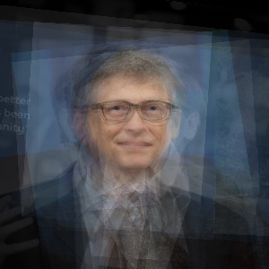 | [@shwars][shwars] | [CognitivePortrait.ipynb](CognitivePortrait.ipynb) | A number of photographs are aligned by their eyes and blended together to create an "average" photograph of a person |
| 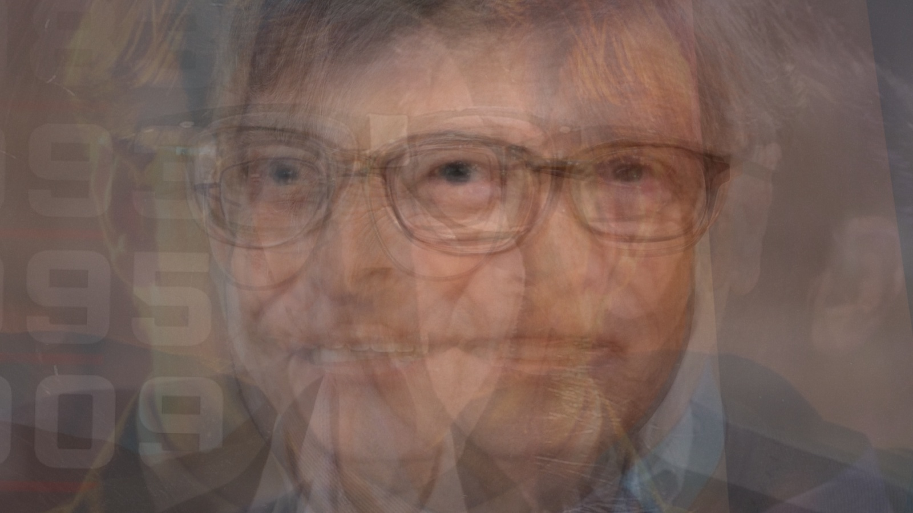 | [@shwars][shwars] | [CognitivePortrait-2face.ipynb](CognitivePortrait-2face.ipynb) | Photographs are grouped into two sets of different ages, and blended side-by-side |
| 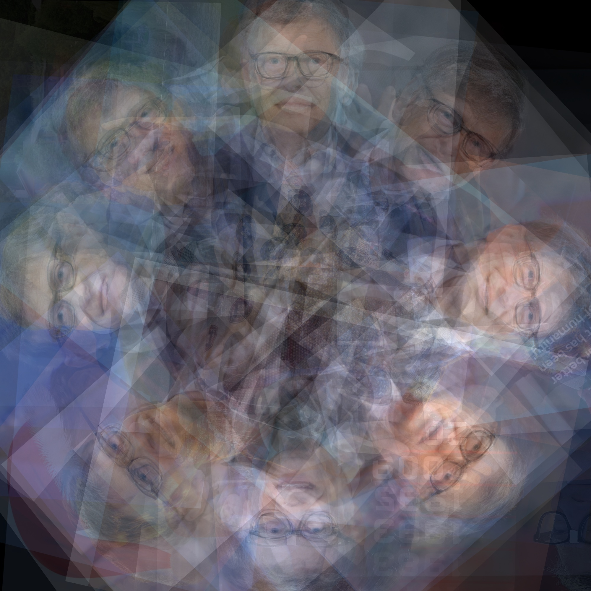 | [@shwars][shwars] | [CognitivePortrait-Circle.ipynb](CognitivePortrait-Circle.ipynb) | Aligning faces to that eyes lie on a circle, creating visual whirlpool |
| 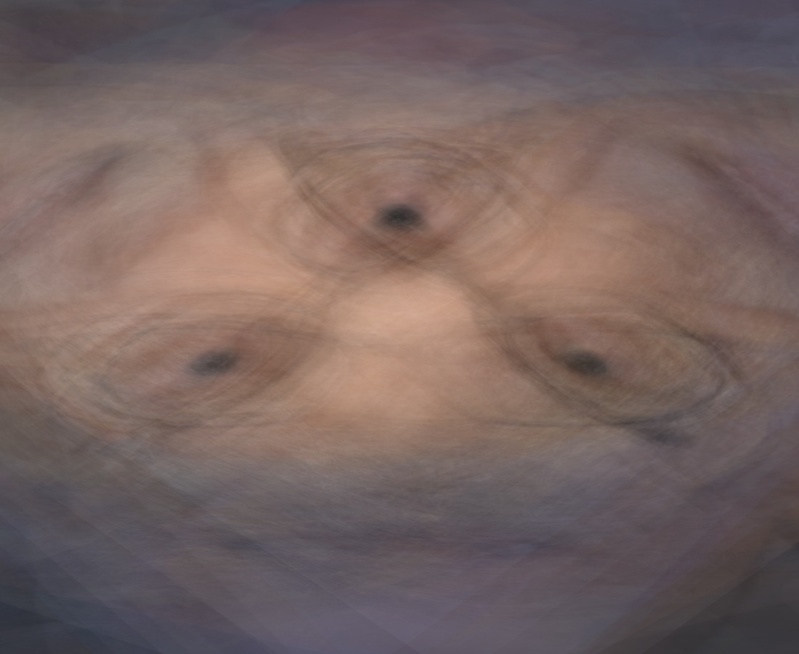 | [@semenovdv][semenovdv] | [CognitivePortrait-ThirdEye.ipynb](CognitivePortrait-ThirdEye.ipynb) | Aligning the pupils into a triangle, thereby making a third eye |
| 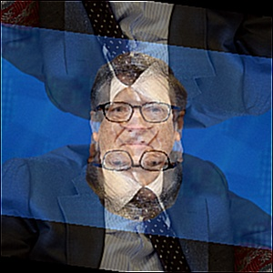 | [@Stifeev](https://github.com/Stifeev) | [CognitivePortrait-ThirdEye.ipynb](CognitivePortrait-ReflectionAqua.py) | Выравнивание с использование меток, отражения, акварельный фильтр |
|----|----|----|----|

## Artwork Gallery

| 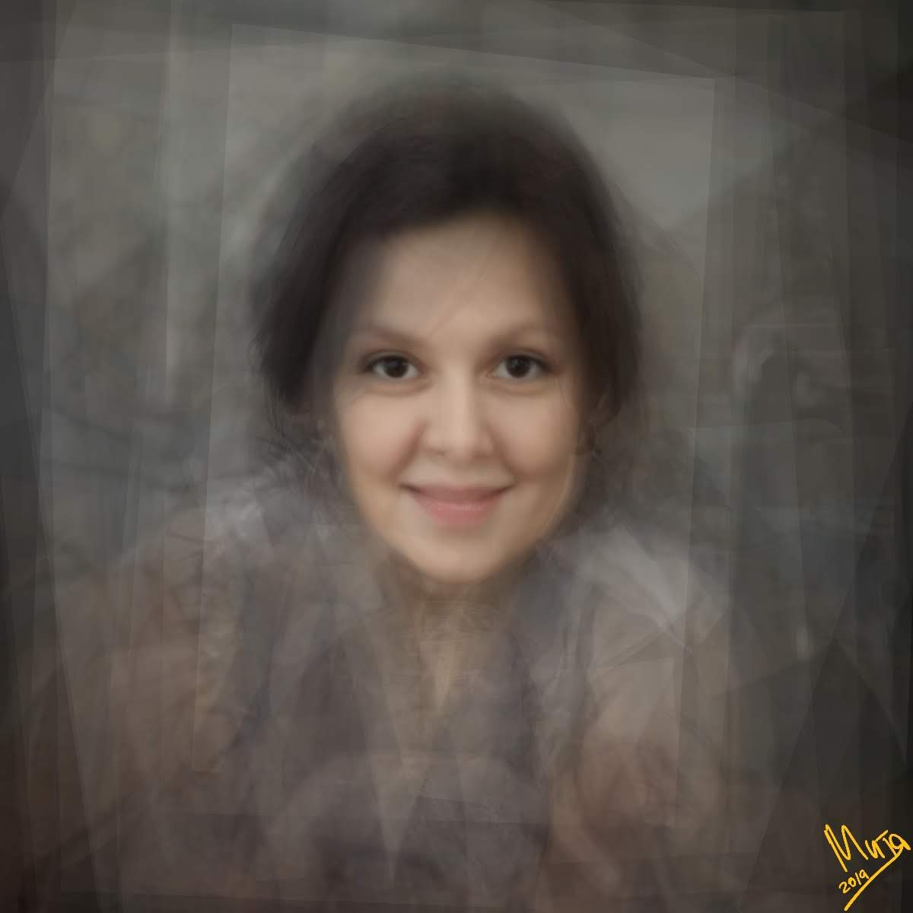 | 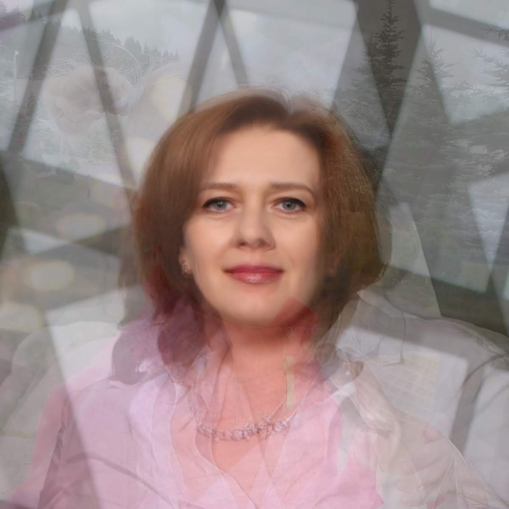 | 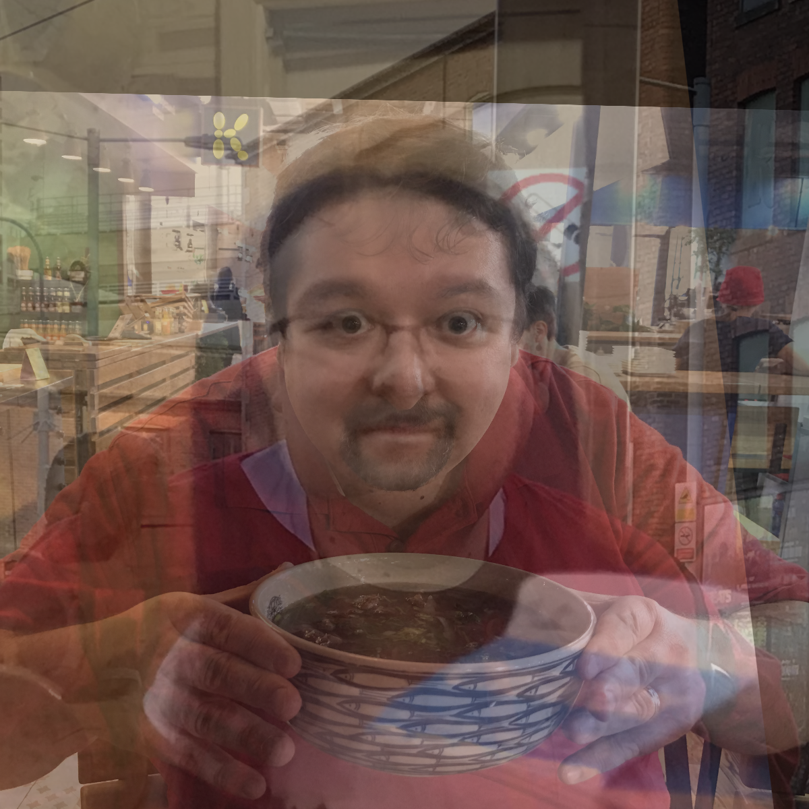 |
|---|---|---|
|[@shwars][shwars]|[@shwars][shwars]|[@shwars][shwars]|
|---|---|---|
| 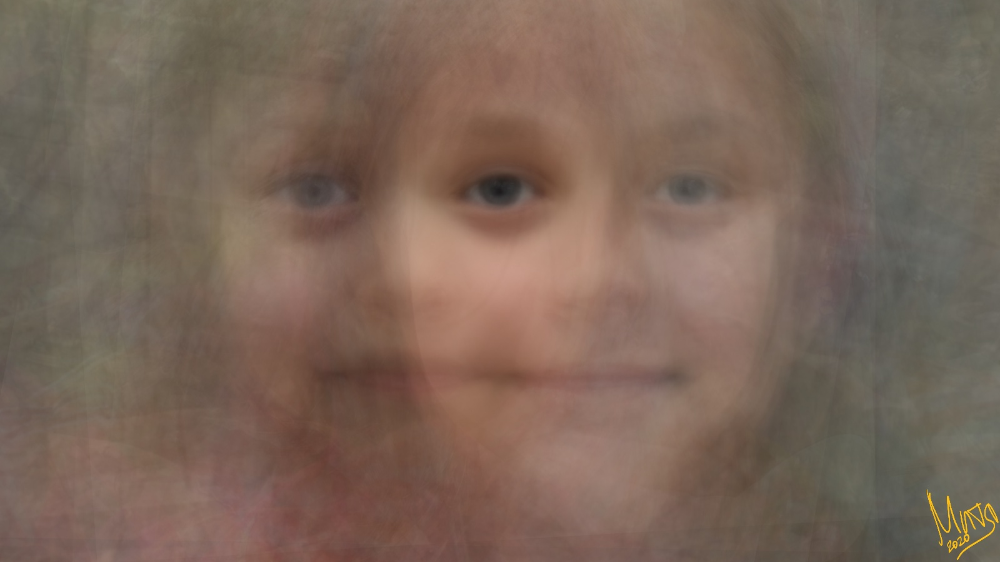 | 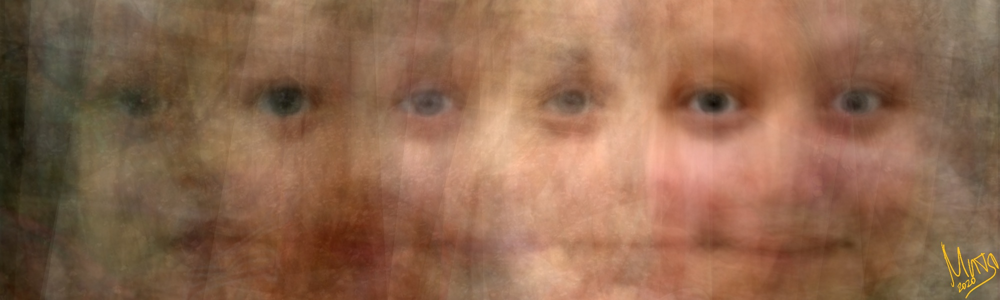 | 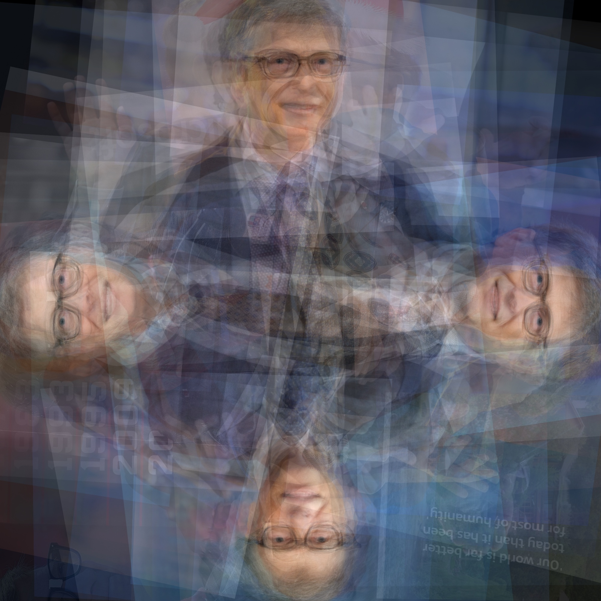 |
|[@shwars][shwars]|[@shwars][shwars]|
| 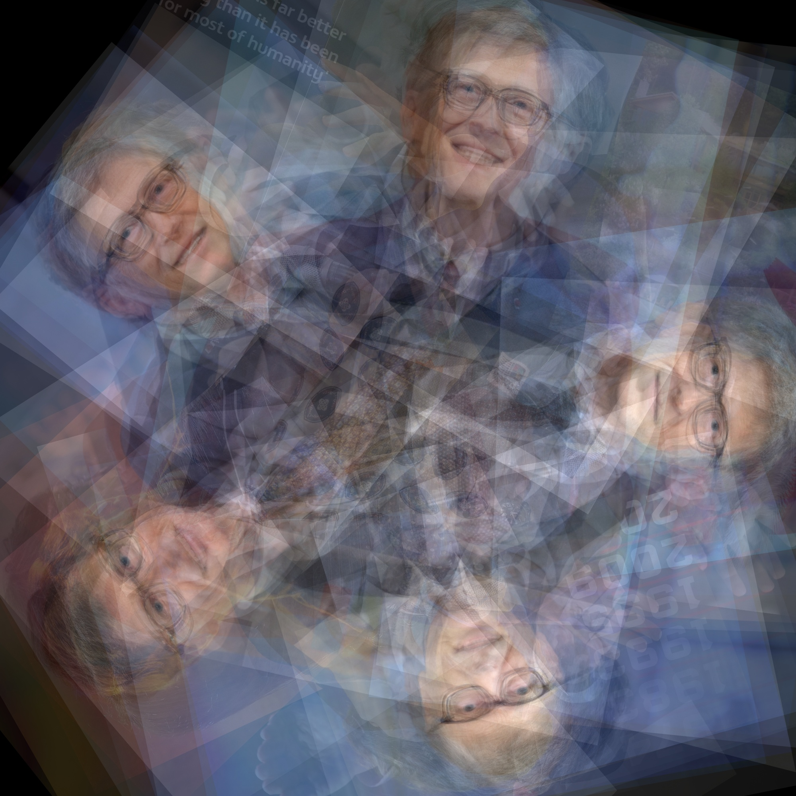 | |
| [@shwars][shwars] | |
|---|---|---|

[FaceAPI]: https://azure.microsoft.com/services/cognitive-services/face/?WT.mc_id=aiapril-github-dmitryso
[shwars]: https://github.com/shwars
[CloneAzNb]: https://notebooks.azure.com/import/gh/CloudAdvocacy/CognitivePortrait
[FaceAPITrial]: https://azure.microsoft.com/try/cognitive-services/my-apis/?api=face-api&WT.mc_id=aiapril-github-dmitryso
